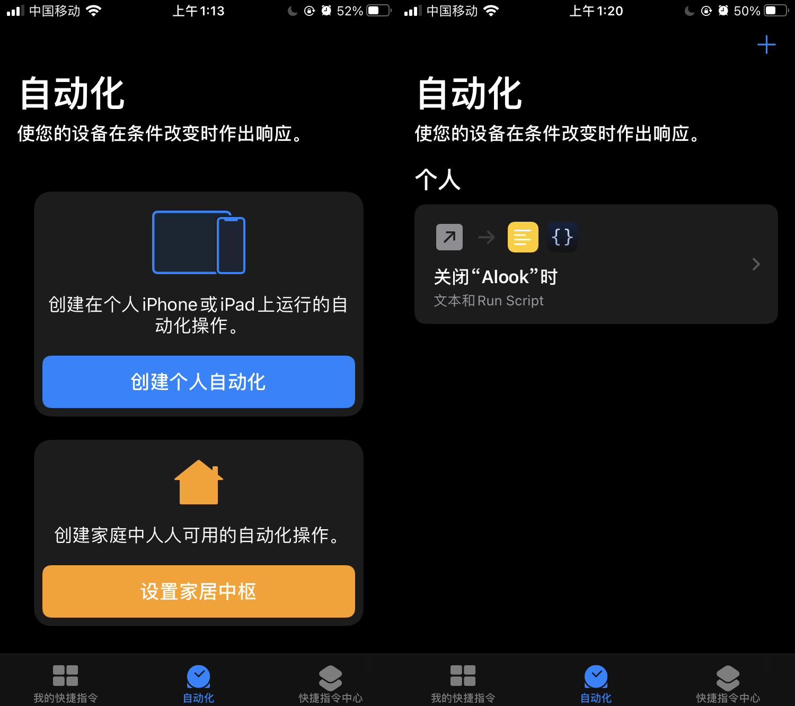
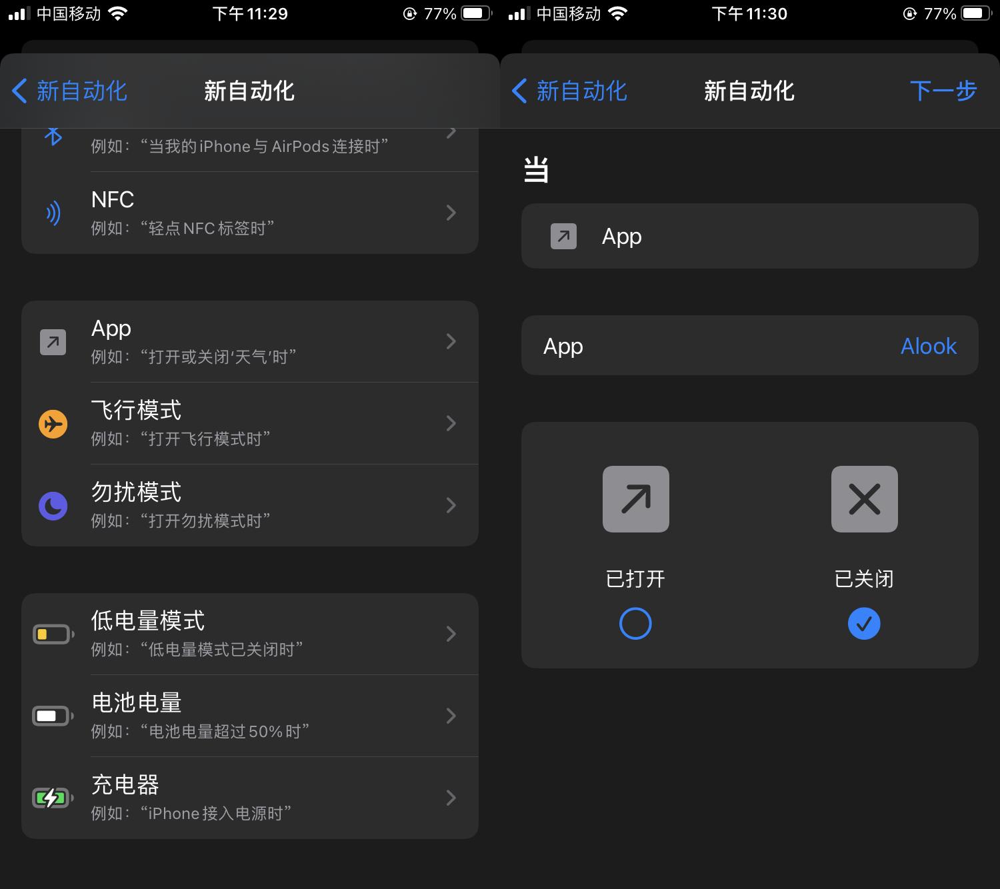
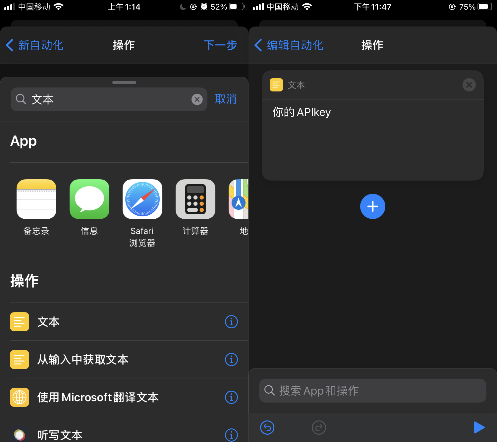
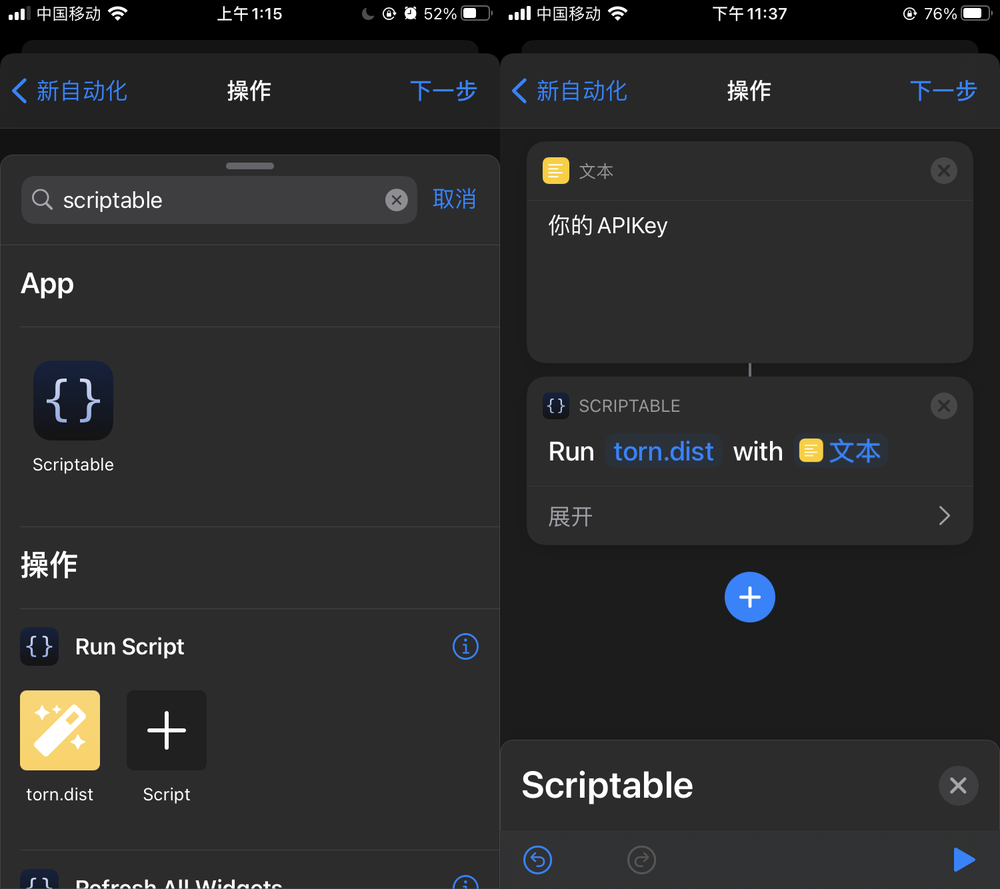

## 在小组件（Widget）中使用

1. 长按主屏幕空白区域直到进入编辑状态，点击右上角“+”。

2. 搜索“Scriptable”小组件，选择小组件尺寸，从左到右依次为“small”、“medium”、“large”。

3. 长按小组件，点击“编辑小组件”。

4. Script选择“torn.dist”，When Interact选择“Open App”，Parameter填入`APIKey`。

## 在快捷指令（Shortcuts）中使用

从0.0.4版本开始支持在快捷指令中运行，主要是为了弥补iOS 14.4以后小组件刷新频率被限制导致的通知设置不及时的缺陷。下面以“关闭alook时执行脚本设置通知”这个场景为例演示在快捷指令中使用的操作步骤：

1. 打开快捷指令app，点击第二个tab“自动化”，点击“创建个人自动化”。如果当前已有自动化，需先点击右上角的“+”再点击“创建个人自动化”。

2. 选择自动化的类型为“App”，选取App为“Alook”，触发条件为“已关闭”。

3. 点击“添加操作”，选择“文本”，文本的内容填入`APIKey`。

4. 再次点击“+”添加操作，选择“Scriptable”，脚本选择“torn.dist”。

5. 点击“下一步”，关闭“运行前询问”开关，点击完成。

## 版本更新

1. 进入Scriptable app，点击“torn.dist“。

2. 点击”检查更新“，如果有新版本则点击”是“

3. 点击左上角”Done“，再次点击“torn.dist“查看版本号是否已更新